<div class="MCWHeader1">
Business continuity and disaster Recovery
</div>

<div class="MCWHeader2">
Before the hands-on lab setup guide
</div>

<div class="MCWHeader3">
October 2019
</div>

Information in this document, including URL and other Internet Web site references, is subject to change without notice. Unless otherwise noted, the example companies, organizations, products, domain names, e-mail addresses, logos, people, places, and events depicted herein are fictitious, and no association with any real company, organization, product, domain name, e-mail address, logo, person, place or event is intended or should be inferred. Complying with all applicable copyright laws is the responsibility of the user. Without limiting the rights under copyright, no part of this document may be reproduced, stored in or introduced into a retrieval system, or transmitted in any form or by any means (electronic, mechanical, photocopying, recording, or otherwise), or for any purpose, without the express written permission of Microsoft Corporation.

Microsoft may have patents, patent applications, trademarks, copyrights, or other intellectual property rights covering subject matter in this document. Except as expressly provided in any written license agreement from Microsoft, the furnishing of this document does not give you any license to these patents, trademarks, copyrights, or other intellectual property.

The names of manufacturers, products, or URLs are provided for informational purposes only and Microsoft makes no representations and warranties, either expressed, implied, or statutory, regarding these manufacturers or the use of the products with any Microsoft technologies. The inclusion of a manufacturer or product does not imply endorsement of Microsoft of the manufacturer or product. Links may be provided to third party sites. Such sites are not under the control of Microsoft and Microsoft is not responsible for the contents of any linked site or any link contained in a linked site, or any changes or updates to such sites. Microsoft is not responsible for webcasting or any other form of transmission received from any linked site. Microsoft is providing these links to you only as a convenience, and the inclusion of any link does not imply endorsement of Microsoft of the site or the products contained therein.

© 2019 Microsoft Corporation. All rights reserved.

**Contents**

<!-- TOC -->

- [Business continuity and disaster recovery before the hands-on lab setup guide](#business-continuity-and-disaster-recovery-before-the-hands-on-lab-setup-guide)
    - [Requirements](#requirements)
    - [Before the hands-on lab](#before-the-hands-on-lab)
        - [Task 1: Create a virtual machine to execute the lab](#task-1-create-a-virtual-machine-to-execute-the-lab)
        - [Task 2: Download hands-on support files to LABVM](#task-2-download-hands-on-support-files-to-labvm)
        - [Task 3: Install SQL Server Express on LABVM](#task-3-install-sql-server-express-on-labvm)
        - [Task 4: Create Azure Resource Groups](#task-4-create-the-resource-groups)

<!-- /TOC -->

# Business continuity and disaster recovery before the hands-on lab setup guide 

## Requirements

- Laptop or tablet, internet browser, reliable and available internet connection

- Azure Subscription with full access to the environment.

## Before the hands-on lab

Duration: 20 minutes

### Task 1: Create a virtual machine to execute the lab

1.  Launch a browser and navigate to the Azure Global portal at <https://portal.azure.com>. Once prompted, login with your Microsoft Azure credentials. If prompted, choose whether your account is an Organization  or Microsoft account.

2.  Select **+Create a resource**, in the search box start typing **Visual Studio Community** and press **Enter**. Select the **Visual Studio 2019 Latest** tile, then choose the **Visual Studio 2019 Community (latest release) on Windows Server 2019 (x64)** software plan.

    >**Note**: Ensure that you select the exact image name identified above. Failure to do so may result in problems successfully completing the BCDR HOL.

    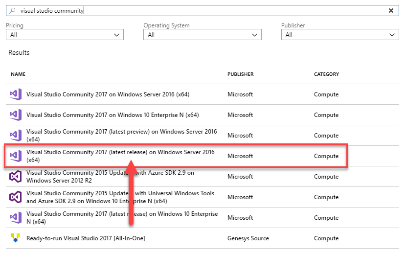

3.  Select **Create**.

4.  Apply the following configuration items on the Basics tab and select **OK**:

    -   **Subscription**: If you have multiple subscriptions, choose the appropriate subscription in which to conduct the lab.

    -   **Resource Group**: BCDRLabRG

    -   **Virtual machine name**: LABVM

    -   **Size**: Choose the **Standard D4s V3** instance size.

    -   **Region**: Choose the Azure region closet to you.

    -   **Username**: mcwadmin

    -   **Password:** demo@pass123
    
    >**Note:** You may want to select the small eyeball icon to ensure you've entered it correctly.
    
    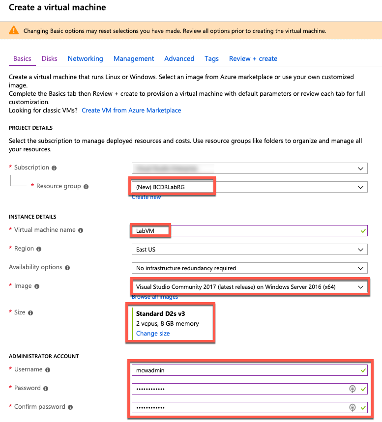

    >**Note:** If the Azure Subscription you are using has limits on the number of cores, you may wish to choose DS1\_V2.

5. Select **Next: Disks**.

    

6.  Select **Premium SSD**, then **Next: Networking>**.

    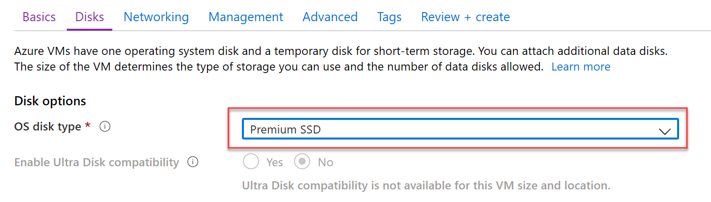

7.  Select **Allow selected ports** and then choose **RDP** (3389) from the **Select  inbound ports** dropdown chooser.  This will enable remote desktop connections from the internet to LABVM.

    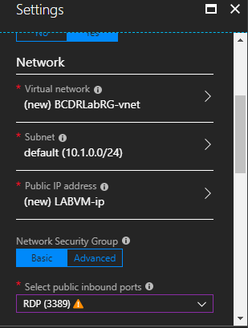

8.  Select **Review + create**.

    
    
9. After validation, select **Create**. The Azure deployment should begin provisioning. It may take 10+ minutes for the virtual machine provisioning to complete.

    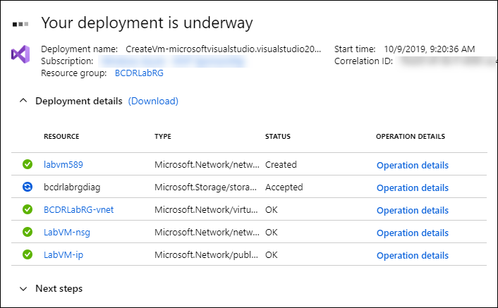

    >**Note:** Please wait for the LABVM to be completely provisioned prior to moving to the next step.

10. Move back to the Portal page on your local machine and wait for **LABVM** to show the Status of **Running**. Select **Connect** to establish a new Remote Desktop Session.

    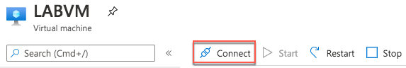

11. Choose **Download RDP File**, then open the `.rdp` file to connect to the VM.

12. Log in to your newly created LABVM with the credentials specified during creation:

    -   **User**: mcwadmin

    -   **Password**: demo@pass123

    

13. You will be presented with a Remote Desktop Connection warning because of a certificate trust issue. Select **Yes** to continue with the connection.

    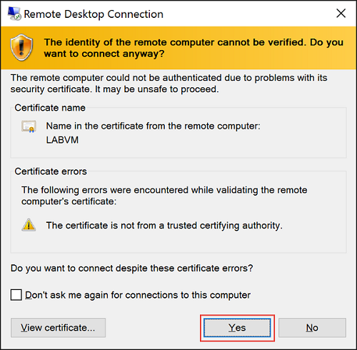

14. When logging on for the first time, you may be prompted about Windows network discovery. Select **No**.

    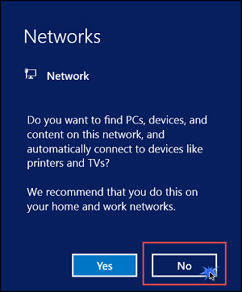

15. Notice that Server Manager opens by default. On the left, select **Local Server** (LABVM).

    

16. On the right side of the pane, select **Off** next to **IE Enhanced Security Configuration**.

    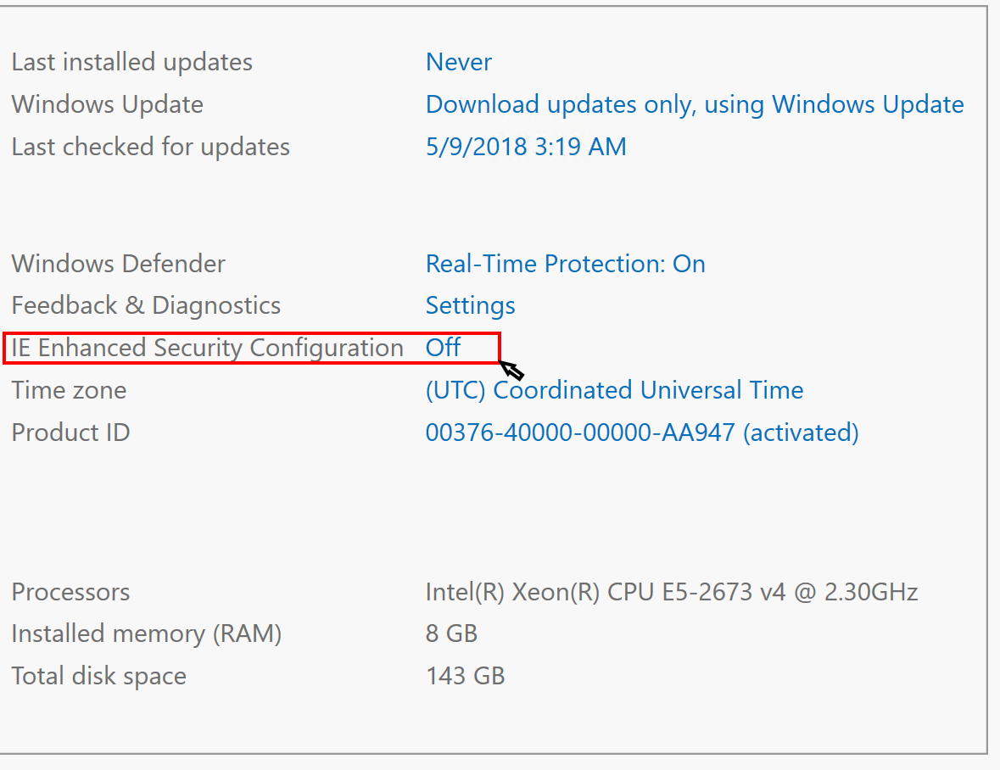

17. Change to **Off** for both Administrators and Users then select **OK**.

    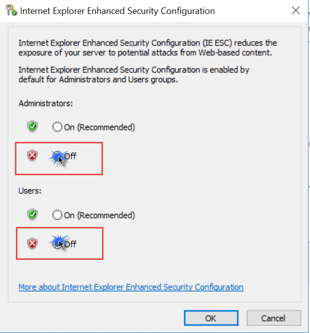

### Task 2: Install Azure PowerShell 'Az' commands

1. Open a PowerShell command-line (be sure to *Run as Administrator*).

2. In the PowerShell command-line, run the following command to install the new Azure PowerShell 'Az' commands:

    ```
    Install-Module -Name Az -AllowClobber
    ```

    > Note: If you have any errors installing the Azure 'Az' PowerShell commands, then reference the following article:
    > <https://azure.microsoft.com/en-us/blog/how-to-migrate-from-azurerm-to-az-in-azure-powershell/>.

### Task 3: Download hands-on support files to LABVM

1.  Download the zipped Hands-on Lab Step by Step student files at the following link: [Student Files](https://github.com/Microsoft/MCW-Business-continuity-and-disaster-recovery/blob/master/Hands-on%20lab/StudentFiles/StudentFiles.zip?raw=true).

2.  Extract the files to a directory here **C:\\HOL** on LABVM.

### Task 4: Install SQL Server Express on LABVM

1.  From within LABVM, open Internet Explorer and browse to the following URL:

    <https://www.microsoft.com/en-US/sql-server/sql-server-downloads>

2.  Select **Download now** under the Express edition of SQL.

    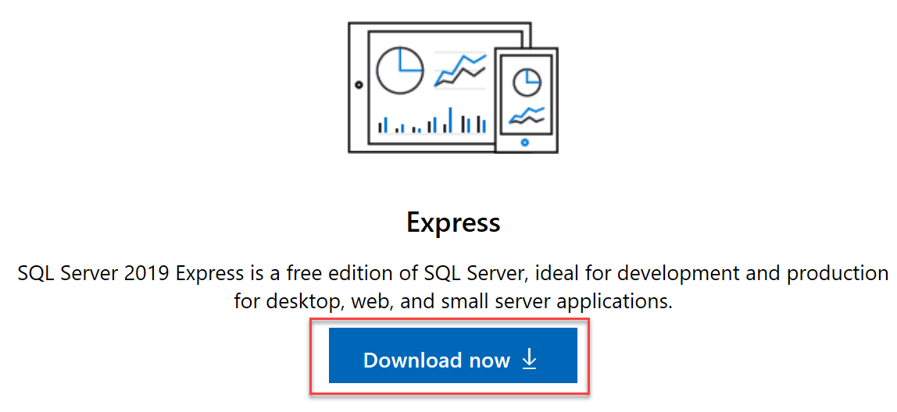

3.  Choose **Run** when prompted after downloading.

    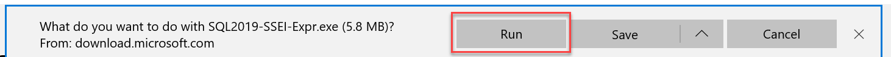

4.  When the installer starts, select **Basic**.

    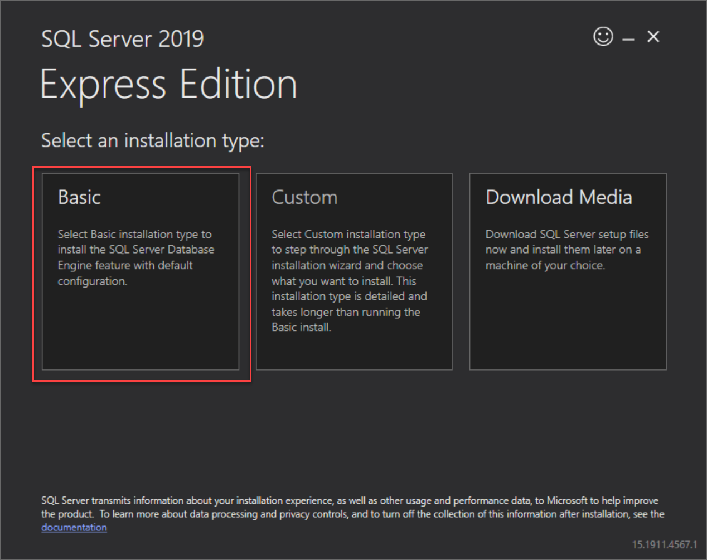

5.  Accept the other defaults in the install wizard until SQL starts to install. This may take 5-10 minutes to complete.

6.  Once the install completes, select the **Install SSMS** button. This will take you to a webpage where you can download and install SQL Server Management Studio (SSMS).

    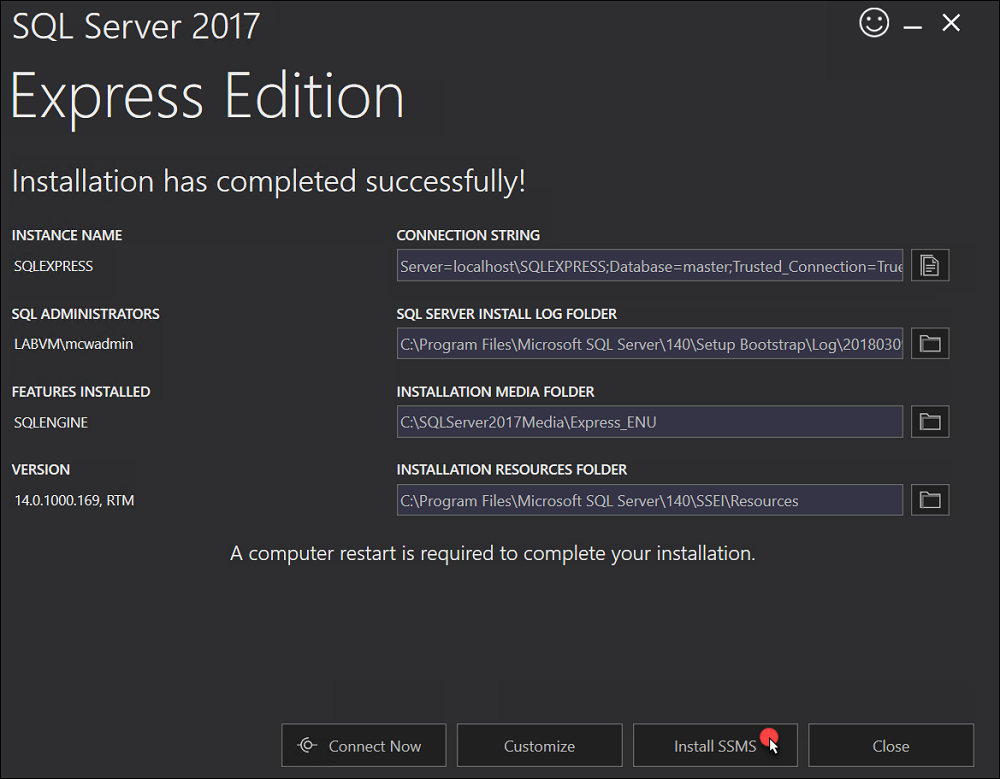

7.  Select the **Download SQL Server Management Studio** link. When prompted, choose **Run**.

    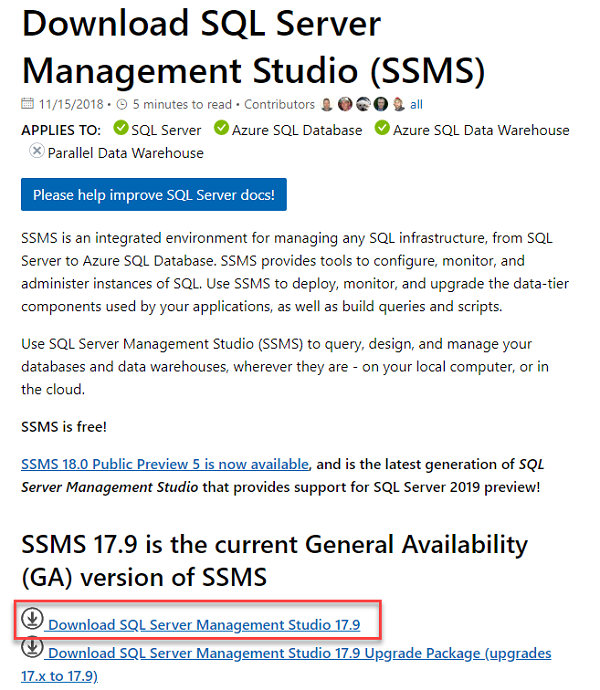

8.  Select **Install** when prompted to begin installing SSMS. This may take 5-10 minutes to complete.

    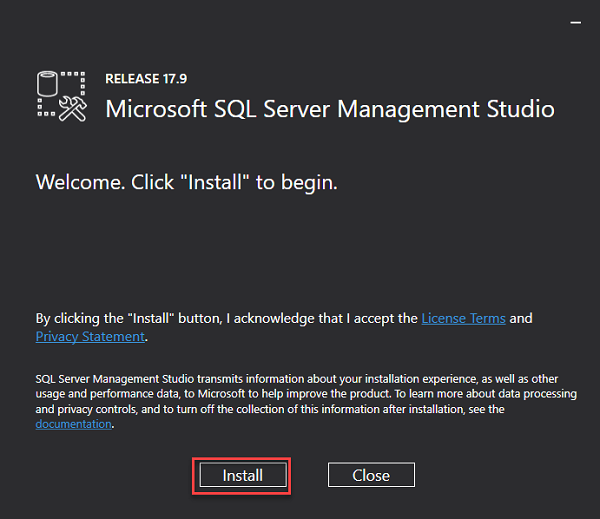

9.  Select **Close** when the installation of SMSS is complete.

10. Select **Close** on the SQL Express Edition setup wizard.

### Task 5: Create Azure Resource Groups

In this task, you will select **Primary** and **Secondary** Azure regions that will be used for the remainder of the BCDR HOL. The **Primary** region should be able to **support V3 virtual machine** sizes, and then you should select the **Secondary** region based on the region pair assigned by Microsoft. Use the Products available by region webpage to determine your **Primary** site: <https://azure.microsoft.com/en-us/regions/services/>. Once you have selected the Primary site,  review the BCDR page to find your Primary Site's Region Pair: <https://docs.microsoft.com/en-us/azure/best-practices-availability-paired-regions>.

>**Note:** The examples in this HOL Guide use the following regions: **Primary:** East US 2 and **Secondary**: Central US. For this lab be sure to use these regions as they are validated to work with all the Azure features / services used throughout this lab.

1.  From the **LABVM**, open Internet Explorer and connect to the Azure portal at: <https://portal.azure.com>.

2.  Select **Resource groups**, then select **+Add**.

    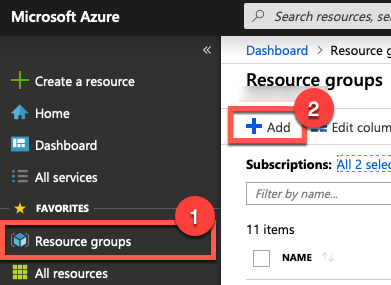

3.  Complete the **Resource group** blade using the following inputs and select **Review + Create** and **Create**:

    - **Resource group name**: BCDRIaaSPrimarySite

    - **Subscription**: Select your subscription.

    - **Resource group location**: East US 2 (Primary region)

    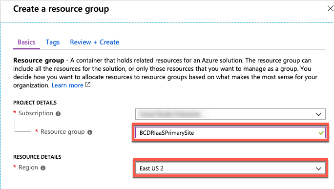

    >**Note:** It's very important to use these exact names. Changing the names of the Resource groups will impact the HOL setup and could cause you not to be able to complete the lab.

4.  Select **Resource groups**, then select **+Add**.

    

5.  Complete the **Resource group** blade using the following inputs and select **Review + Create** and **Create**.

    -   **Resource group name**: BCDRIaaSSecondarySite

    -   **Subscription**: Select your subscription.

    -   **Resource group location**: Central US (Secondary region)

        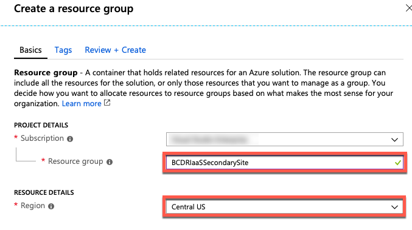

6.  Continue to add the resource groups below to support the HOL:

    | **Resource Group Name** | **Location** |
    |----------|-------------|
    | **BCDRAzureAutomation** | Any available site (other than your Primary or Secondary) regions |
    | **BCDRAzureSiteRecovery** | Central US (Secondary) |
    | **BCDROnPremPrimarySite** | East US 2 (Primary) |
    | **BCDRPaaSPrimarySite** | East US 2 (Primary) |
    | **BCDRPaaSSecondarySite** | Central US (Secondary) |

7.  Once all the resource groups have been created, review all the resource groups for this HOL. **It is critical to ensure that the spelling is correct and that they are in the correct Azure Regions (Primary or Secondary)**.

    >**Note:** If for some reason there is an error, delete the erroneous resource group  and recreate it.

8.  Here is the Azure Portal with each of the resource groups created in the correct Azure Region:

    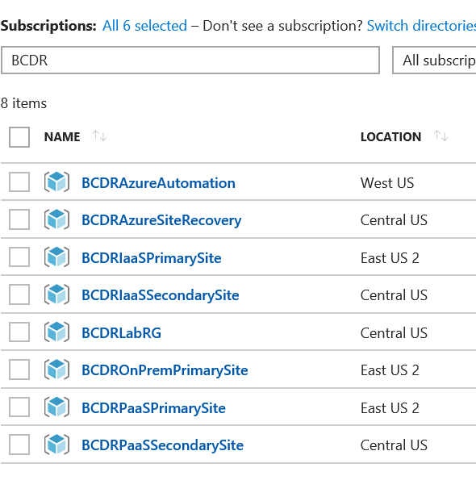

You should follow all steps provided *before* starting the Hands-on Lab.
