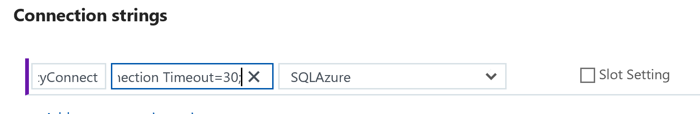

Business continuity and disaster recovery

Hands-on lab unguided

Archived - September 2018

Information in this document, including URL and other Internet Web site references, is subject to change without notice. Unless otherwise noted, the example companies, organizations, products, domain names, e-mail addresses, logos, people, places, and events depicted herein are fictitious, and no association with any real company, organization, product, domain name, e-mail address, logo, person, place or event is intended or should be inferred. Complying with all applicable copyright laws is the responsibility of the user. Without limiting the rights under copyright, no part of this document may be reproduced, stored in or introduced into a retrieval system, or transmitted in any form or by any means (electronic, mechanical, photocopying, recording, or otherwise), or for any purpose, without the express written permission of Microsoft Corporation.

Microsoft may have patents, patent applications, trademarks, copyrights, or other intellectual property rights covering subject matter in this document. Except as expressly provided in any written license agreement from Microsoft, the furnishing of this document does not give you any license to these patents, trademarks, copyrights, or other intellectual property.

The names of manufacturers, products, or URLs are provided for informational purposes only and Microsoft makes no representations and warranties, either expressed, implied, or statutory, regarding these manufacturers or the use of the products with any Microsoft technologies. The inclusion of a manufacturer or product does not imply endorsement of Microsoft of the manufacturer or product. Links may be provided to third party sites. Such sites are not under the control of Microsoft and Microsoft is not responsible for the contents of any linked site or any link contained in a linked site, or any changes or updates to such sites. Microsoft is not responsible for webcasting or any other form of transmission received from any linked site. Microsoft is providing these links to you only as a convenience, and the inclusion of any link does not imply endorsement of Microsoft of the site or the products contained therein.
© 2018 Microsoft Corporation. All rights reserved.

Microsoft and the trademarks listed at https://www.microsoft.com/en-us/legal/intellectualproperty/Trademarks/Usage/General.aspx are trademarks of the Microsoft group of companies. All other trademarks are property of their respective owners.

**Contents**

<!-- TOC -->

- [Business continuity and disaster recovery hands-on lab unguided](#business-continuity-and-disaster-recovery-hands-on-lab-unguided)
    - [Abstract](#abstract)
    - [Overview](#overview)
    - [Solution architecture](#solution-architecture)
        - [Environment: On-premises (migrate to Azure)](#environment-on-premises-migrate-to-azure)
        - [Environment: Azure IaaS (failover region to region)](#environment-azure-iaas-failover-region-to-region)
        - [Environment: Azure PaaS (high-availably with seamless failover)](#environment-azure-paas-high-availably-with-seamless-failover)
    - [Requirements](#requirements)
    - [Exercise 1: Deploy Azure environments](#exercise-1-deploy-azure-environments)
        - [Task 1: Deploy Azure IaaS](#task-1-deploy-azure-iaas)
            - [Tasks to complete](#tasks-to-complete)
            - [Exit criteria](#exit-criteria)
        - [Task 2: Deploy on-premises environment](#task-2-deploy-on-premises-environment)
            - [Tasks to complete](#tasks-to-complete)
            - [Exit criteria](#exit-criteria)
        - [Task 3: Deploy Azure PaaS environment](#task-3-deploy-azure-paas-environment)
            - [Tasks to complete](#tasks-to-complete)
            - [Exit criteria](#exit-criteria)
    - [Exercise 2: Configure BCDR Services](#exercise-2-configure-bcdr-services)
        - [Task 1: Create Azure recovery services vault](#task-1-create-azure-recovery-services-vault)
            - [Tasks to complete](#tasks-to-complete)
            - [Exit criteria](#exit-criteria)
        - [Task 2: Deploy Azure automation](#task-2-deploy-azure-automation)
            - [Tasks to complete](#tasks-to-complete)
            - [Exit criteria](#exit-criteria)
    - [Exercise 3: Configure environments for failover](#exercise-3-configure-environments-for-failover)
        - [Task 1: Configure on-premises to Azure IaaS failover for migration](#task-1-configure-on-premises-to-azure-iaas-failover-for-migration)
            - [Tasks to complete](#tasks-to-complete)
            - [Exit criteria](#exit-criteria)
        - [Task 2: Configure IaaS SQL Always On availability groups for region to region failover](#task-2-configure-iaas-sql-always-on-availability-groups-for-region-to-region-failover)
            - [Tasks to complete](#tasks-to-complete)
            - [Exit criteria](#exit-criteria)
        - [Task 3: Configure IaaS for region to region failover](#task-3-configure-iaas-for-region-to-region-failover)
            - [Tasks to complete](#tasks-to-complete)
            - [Exit criteria](#exit-criteria)
        - [Task 4: Configure PaaS for region to region failover](#task-4-configure-paas-for-region-to-region-failover)
            - [Tasks to complete](#tasks-to-complete)
            - [Exit criteria](#exit-criteria)
    - [Exercise 4: Simulate failovers](#exercise-4-simulate-failovers)
        - [Task 1: Failover Azure IaaS region to region](#task-1-failover-azure-iaas-region-to-region)
            - [Tasks to complete](#tasks-to-complete)
            - [Exit criteria](#exit-criteria)
        - [Task 2: Migrate the on-premises VM to Azure IaaS](#task-2-migrate-the-on-premises-vm-to-azure-iaas)
            - [Tasks to complete](#tasks-to-complete)
            - [Exit criteria](#exit-criteria)
        - [Task 3: Failover and failback Azure PaaS](#task-3-failover-and-failback-azure-paas)
            - [Tasks to complete](#tasks-to-complete)
            - [Exit criteria](#exit-criteria)
        - [Task 4: Failback Azure IaaS region to region](#task-4-failback-azure-iaas-region-to-region)
            - [Tasks to complete](#tasks-to-complete)
            - [Exit criteria](#exit-criteria)
    - [After the hands-on lab](#after-the-hands-on-lab)
        - [Task 1: Disable replication in the recovery services vault](#task-1-disable-replication-in-the-recovery-services-vault)
        - [Task 2: Delete all BCDR resource groups](#task-2-delete-all-bcdr-resource-groups)

<!-- /TOC -->

# Business continuity and disaster recovery hands-on lab unguided 

## Abstract

In this hands-on lab, you will implement three different environments and use Azure BCDR technologies to achieve three distinct goals for each environment type. These will include a migration to Azure, Azure region to region failover, and a PaaS implementation using BCDR technologies to ensure high availability of an application.

At the end of this hands-on lab, you will be better able to build a complex and robust IaaS BCDR solution.  

## Overview

The Business continuity and disaster recovery hands-on lab is an exercise that will challenge you to implement a BCDR solution that includes three different environments and uses Azure BCDR technologies to achieve three distinct goals for each environment type. These will include a migration to Azure, Azure region to region failover using Azure Site Recovery (ASR), and a PaaS implementation using BCDR technologies to ensure high availability of an application.

The hands-on lab can be implemented on your own, but it is highly recommended to pair up with other members at the lab to model a real-world experience and to allow each member to share their expertise for the overall solution.

## Solution architecture

Below are diagrams of the solution architecture you will build in this lab. Please study this carefully, so you understand the whole of the solution as you are working on the various components.

### Environment: On-premises (migrate to Azure)

-   **Background:** This environment will deploy a Hyper-V Host that will host a Linux VM to simulate a Linux, Apache, PHP and MySQL (LAMP), based web application deployed into an on-premises datacenter on a single VM

-   **Goal using Azure BCDR:** Your goal for this environment will be to migrate this application to Azure IaaS with a one-direction failover

    

### Environment: Azure IaaS (failover region to region)

-   **Background:** This environment will consist of two Virtual Networks deployed to your Primary and Secondary site with an AD Domain, IIS Web Servers, and Microsoft SQL Servers that you will configure into a SQL Always On Availability Group.

-   **Goal using Azure BCDR:** Your goal for this environment is to have the ability to have a one-select failover process using Azure Site Recovery in either direction. The users will have one URL that they will use to connect to your application regardless of where the application is running.

    

### Environment: Azure PaaS (high-availably with seamless failover)

-   **Background:** This environment will deploy an Azure Web App and Azure SQL Server in both the Primary and Secondary locations. You will configure SQL Database Failover groups to allow for a seamless failover of the database.

-   **Goal using Azure BCDR:** Your goal for this environment is never to have the users experience any downtime if issues arise with your Web App or the SQL Database. The users will have one URL that they will use to connect to your application regardless of where the application or database is running.

## Requirements

-  Azure Subscription with full access to the environment

## Exercise 1: Deploy Azure environments

Duration: 15 minutes (Deployments can take as long as 75 minutes)

In this exercise, you will use Azure ARM Templates to deploy the following environments that will be used in this HOL:

-   **Azure IaaS:** This environment will consist of two Virtual Networks deployed to your Primary and Secondary site with an AD Domain, IIS Web Servers, and Microsoft SQL Servers that you will configure into a SQL Always On Availability Group

-   **On-premises:** This environment will deploy a Hyper-V Host that will host a Linux VM to simulate a web application deployed into on-premises datacenter on a single VM. Your goal for this environment will be to migrate this application to Azure IaaS with a one-direction failover

-   **Azure PaaS:** This environment will deploy an Azure Web App and Azure SQL Server in both the Primary and Secondary locations

### Task 1: Deploy Azure IaaS

#### Tasks to complete

1.  From the **LABVM**, open Internet Explorer and connect to the Azure portal at <https://portal.azure.com>

2.  Run a template deployment using the **C:\\HOL\\Deployments**\\**BCDRIaaSPrimarySite.json** file. Make sure to select your **BCDRIaaSPrimarySite** resource group. Notice how the template picked the deployment region based on the location of your **BCDRIaaSPrimarySite** resource group. Make sure that this is your **Primary** region.

    

> **Note:** This deployment will take at least 60 minutes, but you can continue to the next task.

#### Exit criteria

-   The Azure IaaS Template deployment was executed, and the **BCDRIaaSPrimarySite** resource group was the target

### Task 2: Deploy on-premises environment

#### Tasks to complete

1.  Run a template deployment using the **C:\\HOL\\Deployments**\\**BCDROnPremPrimarySite.json** file. Make sure to select your **BCDRIaaSOnPremPrimarySite** resource group.

> **Note:** This deployment will take at least 20 minutes, but you can continue to the next task.

#### Exit criteria

-   The Azure IaaS Template deployment was executed, and the **BCDROnPremPrimarySite** resource group was the target

### Task 3: Deploy Azure PaaS environment

#### Tasks to complete

1.  Run a template deployment using the **C:\\HOL\\Deployments**\\**BCDRPaaSPrimarySite.json** file. Make sure to select your **BCDRPaaSPrimarySite** resource group.

> **Note:** This deployment will take at least 10 minutes, but you can continue to the next task.

#### Exit criteria

-   The Azure IaaS Template deployment was executed, and the **BCDRPaaSPrimarySite** resource group was the target.

## Exercise 2: Configure BCDR Services

Duration: 30 minutes

In this exercise, you will create and configure the services that will make it possible to failover both the on-premises and Azure IaaS environments. These will include a Recovery Services Vault used for Azure Site Recovery and an Azure Automation account.

### Task 1: Create Azure recovery services vault

#### Tasks to complete

1.  Using the **LABVM**, connect to the Azure portal using your web browser at: <https://portal.azure.com>

2.  Create a **Recovery Services vault** using the blade with the following inputs:

    -   **Name**: BCDRRSV

    -   **Resource Group**: Use existing / BCDRAzureSiteRecovery

    -   **Location**: Secondary Site (should be automatically selected based on your resource group)

#### Exit criteria

-   A Recovery Services Vault was created in the BCDRAzureSiteRecovery resource group in the **Secondary** Site

### Task 2: Deploy Azure automation

#### Tasks to complete

1.  Create an Azure **Automation Account** using the following inputs:

    -   **Name**: Enter a Globally unique name starting with BCDR

    -   **Resource group**: Use existing / BCDRAzureAutomation

    -   **Location**: Select a site in your Area, but NOT your Primary Site

    -   **Create Azure Run As account**: Yes

> **Note:** Azure Automation accounts are only allowed to be created in certain Azure regions, but they can act on any region in Azure (except Government, China or Germany). It is not a requirement to have your Azure Automation account in the same region as the **BCDRAzureAutomation** resource group but **CANNOT** be in your primary site.

2.  Import the following modules using the Modules Gallery:

    -   **AzureRM.Profile**

    -   **AzureRM.Network**

3.  Import the following run books and then publish them

    -   **C:\\HOL\\Deployments\\ASRRunbookSQL.ps1**

    -   **C:\\HOL\\Deployments\\ASRRunbookWEB.ps1**

4.  From **LABVM**, select **Start** and select **PowerShell ISE** (make sure to right-click and run as Administrator). Run the PowerShell script named **C:\\HOL\\Deployments\\ASRRunBookVariable.ps1.** You will need to authenticate to Azure.

> **Note:** If you are using an account that has multiple subscriptions you may need to change the context of your login. You can comment the **Login-AzureRmAccount** command in the script and complete the login and the use the **Get-AzureRmSubscription** and **Select-AzureRmSubscription** cmdlets to create the proper context for this HOL. For help you can review this article: <https://docs.microsoft.com/en-us/powershell/azure/authenticate-azureps?view=azurermps-5.1.1> & <https://docs.microsoft.com/en-us/powershell/azure/manage-subscriptions-azureps?view=azurermps-5.1.1>

> **Note:** When you configure the ASR Recovery Plan for the IaaS deployment, you will use the SQL Runbook as a Pre-Failover Action and the Web Runbook as a Post-Failover action. They will run both ways and have been written to take the "direction" of the failover into account when running.

#### Exit criteria

-   An Azure Automation account was created in a region other than the Primary or Secondary site you have selected

-   Both the AzureRM.Profile and AzureRM.Network modules have been imported

-   The following runbooks have been imported and published to the Automation account: **C:\\HOL\\Deployments\\ASRRunbookSQL.ps1** & **C:\\HOL\\Deployments\\ASRRunbookWEB.ps1**

-   The script **C:\\HOL\\Deployments\\ASRRunBookVariable.ps1** was executed successfully, and you now have a variable named BCDRIaaSPlan in your Azure automation account

## Exercise 3: Configure environments for failover

Duration: 90 minutes

In this exercise, you will configure the three environments to use BCDR technologies found in Azure. Each environment has unique configurations that must be completed to ensure their availability in the event of a disaster.

> **Note:** Prior to starting each task, make sure that the deployment that you started in Exercise 1 has completed for each as you come to that task. This can be determined by reviewing the deployments for each Resource group in the Azure portal. If it says "succeeded", then you can begin the task.

### Task 1: Configure on-premises to Azure IaaS failover for migration

In this task, the **OnPremVM** will be configured to replicate to Azure and be ready to failover to the **BCDRIaaSSecondarySite**. This will consist of configuring your Hyper-V host with the ASR provider and then enabling replication of the VM to the Recovery Service Vault.

#### Tasks to complete

1.  From the Azure portal, open the **BCDRRSV** Recovery Services Vault located in the **BCDRAzureSiteRecovery** resource group

2.  Walk through the **Prepare Infrastructure** **For On-Premises Machines** wizard in the Azure portal. This will start you down a path of various steps to configure your VM that is running on Hyper-V on-premises to be replicated to Azure. Use the following inputs:

    -   **Where are your machines located?:** On-Premises

    -   **Where do you want to replicate your machines to?:** To Azure

    -   **Are your machines virtualized?:** Yes, with Hyper-V (your VM is running as a nested VM in Azure)

    -   **Are you using System center VMM to manage your Hyper-V hosts?:** No

    -   **On the Create Hyper-V site blade, enter the name:** OnPremHyperVSite and select **OK**

    -   Select **+Hyper-V Server**

3.  A new blade will appear. You will need to download the vault registration key to register the host in the Hyper-V site of ASR. Select the Download button which will save the file to your Downloads folder on the **LABVM**.

4.  Open a **NEW** tab in your web browser and connect again to the Azure Portal at <https://portal.azure.com>

5.  Connect to the **HYPERVHOST** VM and run the URL to download the download the Azure Site Recovery Provider for Hyper-V. Run the installation and when prompted use the vault registration key you downloaded from the Azure portal:

-   **User Name**: mcwadmin

-   **Password**: demo\@pass123

    http://aka.ms/downloaddra_cus

6.  Open Hyper-V Manager, select the Server name in the left pane, and then you will see that the **OnPremVM** virtual machine is running on your **HYPERVHOST**. This is an Ubuntu 16.04.3 LTS server running Apache, PHP and MySQL. Double-click on the VM to open.

    

7.  Login to the VM using the following credentials. Once logged in enter a few commands and notice that you can get to the internet and that the **local IP address of the VM is currently 192.168.0.10**:

    a.  **User Name**: mcwadmin

    b.  **Password**: demo\@pass123

8.  Open Internet Explorer on **HYPERVHOST** and browse to the following URL of the OnPremVM. This is very simple PHP application running on the OnPremVM connected to the MySQL Server that is running locally on the VM. This is to simulate an application is that running on one VM in the on-premises data center.

    http://192.168.0.10/bcdr.php

    

9.  From the command prompt of the **OnPremVM**, update the OS with the latest patches by using the following command. You will need to enter the password again.

    sudo apt-get update -y

10. After the updates complete, install the Azure Guest Agent for Linux on the VM using the following commands:

    sudo apt-get install walinuxagent -y

    

> **Note:** You may see some errors, but this is normal behavior since the VM now thinks it should be in Azure.

11. Move back to the portal and add the Hyper-V server. Adding a Premium Storage account for the VM.

12. Create and Associate a Replication Policy and then complete the wizard

13. Start the wizard to replicate the Application On-premises to Hyper-V Site. Use the following inputs:

    -   **Post-failover resource group**: BCDRIaaSSecondarySite

    -   **Storage Account**: Select the account you just created (onpremvm8675309)

    -   **Storage Account for replication logs**: create a new one using the prefix bcdrasrrepllogs

    -   **Azure network**: configure now for selected machines

    -   **Post-failover Azure network**: BCDRFOVNET

    -   **Subnet**: WEB (172.16.1.0/24)

14. Verify that your VM has been added and is starting to replicate

> **Note:** It will take about 15 minutes for the VM to replicate, so you can move add come back to review the environment later.

#### Exit criteria

-   The Hyper-V Site and Server have been added

-   Then Azure Linux Agent was installed on the **OnPremVM**

-   The **OnPremVM** has been added to a replication policy, and that replication has started

### Task 2: Configure IaaS SQL Always On availability groups for region to region failover

In this task, you will build a Windows Failover Cluster and configure SQL Always On Availability Groups. This will be in place to ensure that if there is an issue in the **Primary** site in Azure you can failover to the **Secondary** site and have access to the data for the application. You will also configure the Traffic Manager to ensure that the Web Application will always answer to the same DNS name even when it is failed over to the **Secondary** site.

#### Tasks to complete

1.  From the **LABVM** navigate to the Azure Portal and add a storage account using the following inputs:

    -   **Name**: Unique name starting with bcdrcloudwitnessxxx

    -   **Deployment model**: Resource manager

    -   **Account kind**: Storage (general purpose v1)

    -   **Performance**: Standard

    -   **Replication:** Locally-redundant storage (LRS)

    -   **Access tier**: Hot

    -   **Resource group**: Use existing / BCDRAzureSiteRecovery

    -   **Location**: any location in your area that is NOT your Primary or Secondary Site

2.  Save the Storage Account Name and Keys to a new file you create named **C:\\HOL\\Deployments\\CloudWitness.txt** on your **LABVM**

    

    

3.  Select **BCDRDC1** and then select **Connect** to **SQLVM1**, which are found in the **BCDRIaaSPrimarySite** resource group:

    -   **User Name**: CONTOSO\\mcwadmin

    -   **Password**: demo\@pass123

4.  Copy the following files from your LABVM to SQLVM1:

    -   **C:\\HOL\\Deployments**\\**ClusterCreateSQLVM1.ps1**

    -   **C:\\HOL\\Deployments**\\**ClusterUpdateSQLVM1.ps1**

    -   **C:\\HOL\\Deployments**\\**CloudWitness.txt**

5.  On **SQLVM1**, select Start and then select **PowerShell ISE** and run the **ClusterCreateSQLVM1.ps1**. This script will create the Windows Failover Cluster and add all the SQL VMs as nodes in the cluster. It will also assign a static IP address of 10.0.2.99 to the new Cluster named **AOGCLUSTER**.

> **Note:** It is possible to use a wizard for this task, but the resulting cluster will require additional configuration to set the static IP address in Azure.

6.  Review the new cluster using Failover Cluster Manager

    

    

    

7.  Configure a Cloud Witness for the Cluster using the storage account you just created

    

    

8.  Select **Start** and Launch **SQL Server 2017 Configuration Manager**

    

9.  Select **SQL Server Services**, then right-click **SQL Server (MSSQLSERVER)** and select **Properties**

    

10. Select the **AlwaysOn High Availability** tab and check the box for **Enable AlwaysOn Availability Groups**, then select **Apply**. Select **OK** on the message that changes won't take effect until after the server is restarted.

    

11. On the **Log On** tab, change the service account to **contoso\\mcwadmin** with the password **demo\@pass123**. Select **OK** to accept the changes, and then select **Yes** to confirm the restart of the server.

    

12. Open a new Remote desktop session (this can be done from within SQLVM1) and repeat these steps to **Enable SQL Always On** and change the User name to **contoso\\mcwadmin** on each of the other nodes: **SQLVM2** and **SQLVM3.** Make sure that you have restarted the SQL Service on each node prior to moving to the next node.

> **Note:** If you get confused what server you are on open a command prompt and simply enter the command *hostname.*

13. After you have completed the process on each SQLVM Node, reconnect to **SQLVM1** using Remote Desktop

> **Note:** Remember that you must use the BCDRDC1 VM as your jumpbox to get into the environment. You can use the Azure portal to connect to BCDRDC1 and then use Remote desktop from there to SQLVM1.

14. Use the Start menu to launch **Microsoft SQL Server Management Studio 17** and connect to the local instance of SQL Server (located in the Microsoft SQL Server Tools 17 folder)

    

15. Select **Connect** to Sign On to **SQLVM1**

    

16. Right-click **Always On High Availability**, then select **New Availability Group Wizard**

    

17. Select **Next** on the Wizard

    

18. Provide the name **BCDRAOG** for the **Availability group name**, then select **Next**

    

19. Select the ContosoInsurance Database, then select **Next**

    

20. On the Specify Replicas screen next to **SQLVM1** select **Automatic Failover**

    

21. Select **Add Replica**

    

22. On the Connect to Server enter the Server Name of **SQLVM2** and select **Connect**

    

23. For **SQLVM2**, select Automatic Failover and Availability Mode of Synchronous commit

    

24. Select **Add Replica**

    

25. On the Connect to Server, enter the Server Name of **SQLVM3** and select **Connect**

    

26. At this point, the wizard should resemble the following.

    

27. Select Endpoints and review these that the wizard has created

    

28. Next, select **Listener**. Then select the **Create an availability group listener**

    

29. Add the following details:

-   **Listener DNS Name**: BCDRAOG

-   **Port**: 1433

-   **Network Mode**: Static IP

    

30. Next, select **Add**

    

31. Select the Subnet of **10.0.2.0/24** and then add IPv4 **10.0.2.100** and select **OK**. This is the IP address of the Internal Load Balancer that is in front of the **SQLVM1** and **SQLVM2** in the **BCDRVNET** **Data** Subnet running in the **Primary** Site.

    

32. Select **Add**

    

33. Select the Subnet of **172.16.2.0/24** and then add IPv4 **172.16.2.100** and select **OK**. This is the IP address of the Internal Load Balancer that is in front of the **SQLVM3** and **SQLVM4** in the **BCDRFOVNET** **Data** Subnet running in the **Secondary** Site.

    

34. Select **Next**

    

35. On the Select Initial Data Synchronization screen, make sure that **Automatic seeding** is selected and select **Next**

    

36. On the Validation screen, you should see all green. Select **Next**.

    

37. On the Summary page select **Finish**

    

38. The wizard will configure the AOG

    

39. Once the AOG is built, select **Close**

    

40. Move back to **SQL Management Studio** on **SQLVM1** and open the **Always On High Availability** and then select on the **BCDRAOG (Primary)**. Expand the areas and review them.

    

41. Right-click **BCDRAOG (Primary)** and then **Show Dashboard.** You should see that all the nodes have been added and are now "Green".

    

    

42. Next, select **Connect** and then **Database Engine** in SQL Management Studio

    

43. Enter **BCDRAOG** as the Server Name. This will be connected to the listener of the group that you created.

    

44. Once connected to the **BCDRAOG**, you can select **Databases** and be able to see the database there. Notice that you have no knowledge directly of which server this is running on.

    

45. Move back to PowerShell ISE on **SQLVM1** and open the PowerShell script named **ClusterUpdateSQLVM1.ps1**. Select the **Play** button. This will update the Failover cluster with the IP Addresses of the Listener that you created for the AOG.

46. Move back to SQL Management Studio and select **Connect** and then **Database Engine**

    

47. This time put in the IP address of the Internal Load balancer of the **Primary** Site AOG Load Balancer: **10.0.2.100**. You again will be able to connect to the server which is up and running as the master.

    

48. Once connected to **10.0.2.100**, you can select **Databases** and will be able to see the database there. Notice that you have no knowledge directly of which server this is running on.

    

> **Note:** It could take a minute to connect the first time as this is going through the Azure Internal Load Balancer.

49. Move back to Failover Cluster Manager on **SQLVM1**. You can review the IP Addresses that were added by selecting Roles and **BCDRAOG** and viewing the resources. Notice how the **10.0.2.100** is online since the current primary replica is on the **Primary** site.

    

50. Now that the AOG is up and running online, the Contoso Insurance Web Application should be available. Minimize the RDP window and from the **LABVM** open the Azure portal and navigate to the resource group **BCDRIaaSPrimarySite**. Select the **WWWEXTLB-PIP**, which is the Public IP address for the external load balancer **WWWEXTLB** in front of **WEBVM1** and **WEBVM2**, in your Primary region.

    

51. Locate the DNS name address and copy it to your clipboard

    

52. Open a new tab in the browser and navigate to the DNS name. The **Contoso Insurance PolicyConnect** application should load in your browser. Select the **Current Policy Offerings** button to check on database connectivity.

    

53. If you can see the offerings, then the application is able to access the database. You can also go back to the home page and interact with the application including adding, editing, or deleting data.

    

> **Note:** If you see the following screen shot then something is not configured correctly with your environment. The connection string of the application is configured to use the name of **bcdraog.contoso.com**, which is the name for the SQL AOG listener. This configuration is part of the connection string located in the **web.config** file, which is on **WEBVM1** and **WEBVM2** in the **C:\\Inetpub\\wwwroot** directory. If you for some reason you named something incorrectly, you can make a change to this file and then iisreset /restart from the command line on the WEBVMs.

54. Use the Portal to create a new Traffic Manager profile using the following inputs, then select **Create**:

    -   **Name:** unique name all lowercase using bcdriaasxxx

    -   **Routing method:** Priority

    -   **Resource group:** Use existing / BCDRIaasPrimarySite

    -   **Location:** automatically assigned based on the BCDRIaaSPrimarySite

55. Create two new **Endpoints** that point to the Public IP addresses of the External load balancers located your **Primary** and **Secondary** sites

56. Once the second endpoint has been added, select **Overview**. Notice that the Primary endpoint is set to **Priority 1**. This means that traffic will always be directed to the **Primary** site unless it is down. The Traffic Manager will monitor the Endpoints and if the **Primary** site moves to a **Monitor Status** of **Degraded**, then the Traffic Manager will direct traffic to the **Secondary** site. The current **Monitor Status** shows that the **Primary** site is **Online** and the Secondary site is **Degraded**. During a failover using ASR, the **Primary** site will move to **Degraded,** and the **Secondary** will move to **Online**. This will allow for traffic to flow to the failed over IaaS infrastructure now running at the **Secondary** site. This will of course revert during the failback to the **Primary** site.

> **Note:** All of this is automatic and easily configured with a vanity domain by adding a C NAME record in DNS to point to the DNS name of the Traffic manager. This would allow for a site like [www.contoso.com](http://www.contoso.com) to resolve to the DNS name of the traffic manager. The users will never know that the site is failed over or failed back.

57. Select the DNS name of the Traffic manager and the Policy Connect web application will load

    

#### Exit criteria

-   The Cloud Witness was established to monitor the Windows Failover Cluster

-   The SQL Always On Group BCDRAOG was established and there are replicas on **SQLVM1**, **SQLVM2** and **SQLVM3** (A-Sync)

-   The Contoso Insurance Website is up and running including connection to the database. This was verified when data loaded after selecting the **Current Policy Offerings** button on the home page.

-   The Traffic Manager was configured. The **Primary** endpoint shows as **Online,** and the **Secondary** shows as **Degraded**

### Task 3: Configure IaaS for region to region failover

In this task, the **WEBVM1** and **WEBVM2** will be configured to replicate from the Primary Site to the Secondary site to support an Azure region to region failover. This will consist of configuring the VMs to replicate and integrating with the Azure Automation to failover the SQL Always On group from the Primary Site to the Secondary. Once the failover is complete, the website will again answer to the Traffic Manager DNS name.

#### Tasks to complete

1.  From the Azure portal on **LABVM**, open the **BCDRRSV** Recovery Services Vault located in the **BCDRAzureSiteRecovery** resource group.

2.  Use the **Replicate Application** in the **For On-Premises Machines and Azure VMs** section using the following inputs:

-   **Source:** Azure

-   **Source Location**: Your Primary Region

-   **Azure virtual machine deployment model**: Resource Manager

-   **Source resource group:** BCDRIaaSPrimarySite

-   On **Step 2 Virtual Machines** select **WEBVM1** and **WEBVM2** and select **OK**

-   **Target location** as your **Secondary** Site Azure Region

3.  Customize your Target

    

4.  Update the rest of the blade using the following inputs and the select **OK**:

-   **Target resource group**: BCDRIaaSSecondarySite

-   **Target virtual network**: BCDRFOVNET

-   **Target storage**: accept the new account

-   **Target storage**: accept the new account

-   **Target Availability Set**: WEBAVSET

    

> **Note:** Double check these selections. They are critical to your Failover.

5.  Navigate back to the Recovery Services Vault **BCDRRSV** and you will now see that 3 items are replicated

6.  Once **WEBVM1** and **WEBVM2** have reached Protected status, you can move on to the next step

> **Note:** It can take up to 30 minutes for this action to complete.

7.  Build a **Recovery Plans** using the following inputs:

    -   **Name:** BCDRIaaSPlan

    -   Select your **Primary** site

    -   **Target:** Secondary region

    -   **Allow items with deployment model**: Resource Manager

    -   **Select Items**: Select **WEBVM1** and **WEBVM2**

8.  Customize the recovery plan

9.  Once the **BCDRIaaSPlan** blade loads, select the **ellipse** next to **All groups failover**

    

10. Select **Add pre-action**

    

11. On the **Insert action** blade, select **Script** and then provide the name: **ASRSQLFailover.** Ensure that your Azure Automation account is selected and then chose the Runbook name: **ASRSQLFailover**. Select **OK**.

    

12. Once the **BCDRIaaSPlan** blade loads, select the **ellipse** next to **Group 1: Start**

    

13. Select **Add post action**

    

14. On the **Insert action** blade, select **Script** and then provide the name: **ASRWEBFailover.** Ensure that your Azure Automation account is selected and then chose the Runbook name: **ASRWEBFailover**. Select **OK**.

    

15. Make sure that your **Pre-steps** are running under **All groups failover** and the **Post-steps** are running under the **Group1: Start.** Select **Save**.

    

#### Exit criteria

-   The **WEBVM1** and **WEBVM2** have be configured with a Replication Plan

-   The Pre-Action and Post-Actions have been configured to reference the correct Azure Automation Runbooks and are in the correct placement

### Task 4: Configure PaaS for region to region failover

In this task you will deploy the website to App Services using Visual Studio, migrate a database to Azure SQL Database and configure it for high-availability using an Azure SQL Database Failover Group. The Traffic Manager will be used to direct traffic to the closest front end to the user. If there is a failover of the database, it will happen transparently, and the users will never know there was an outage. There is no reconfiguration required for this to function properly.

#### Tasks to complete

1.  From the **LABVM**, open the Azure portal at: <https://portal.azure.com>

2.  Navigate to the **BCDRPaaSPrimarySite** resource group and capture the FQDN name of the SQL Server in a file

    as **C:\\HOL\\Deployments\\SQLSERVER.txt.**

    

3.  Use the Start menu to launch **Microsoft SQL Server Management Studio 17** and connect to the local instance of SQL Server **LABVM\\SQLEXPRESS**

    

4.  Restore the Database by right-clicking **Databases**, and then selecting **Restore Database** located on the **C:\\HOL\\Database\\ContosoInsurnace.bak** device

    

5.  Use SQL Management Studio to **Deploy Database to Microsoft Azure SQL Database**. Use the server name that you can captured in the **SQLSERVER.TXT**. Change the Authentication to **SQL Server Authentication**, enter the credentials for the server, and then select **Connect.**

    -   **Login**: mcwadmin

    -   **Password:** demo\@pass123

    -   **Edition of Azure SQL database**: Standard

    -   **Maximum database size (GB):** 1

    -   **Service Objective**: S1

        

        

6.  Capture the Database connection string for the newly migrated SQL Database called **ContosoInsurance** in the **BCDRPaaSPrimarySite** resource group and save it to your **SQLSERVER.TXT** file

    

7.  Use the Azure portal open the SQL Server in **BCDRPrimaryPaaSSite** resource group again and create a new Failover group using the following inputs:

    -   **Failover group name:** enter a lowercase unique name 3-24 characters using bcdrpassfogxxx

    -   **Secondary Server:** select the secondary SQL Server from your BCDRPaaSSecondarySite

    -   **Database within the group:** ContosoInsurnace

8.  The Failover group (FOG), portal will appear. Copy the name of the Listener endpoint to your clipboard and then copy this to your **SQLSERVER.TXT** file

    

    

9.  In the **SQLSERVER.TXT** file, **update the server name** in the connection string with the name of the FOG listener endpoint. Also, **change the user name and password** to the credentials for the SQL Server:

    -   **Username:** mcwadmin

    -   **Password:** demo\@pass123

        

        

10. The new connection string will be used for the Web App. This will ensure that when the SQL Database is failed over that the server is always pointing to the Failover group. Open the Web App in the **BCDRPaaSPrimarySite** resource group and add a new connection string using the following inputs:

    -   **Name:** PolicyConnect

    -   **Value:** Paste in the updated string you created with the Failover group name from the SQLSERVER.TXT file.

        

> **Note:** You must use the Name **PolicyConnect**. This is the name that the recognized by the Application in the source code.

11. Repeat the same procedure on the Web App located in the **BCDRPaaSSecondarySite** resource group using the same connection string:

    -   **Name:** PolicyConnect

    -   **Value:** Paste in the updated string you created with the Failover group name from the SQLSERVER.TXT file

12. On the LABVM, open **Visual Studio**. You will be required to login to Visual Studio. If you don't have an account, you can create a free account following the prompts.

    

13. Select File, Open, Project/Solution

    

14. Open the Solution located at **C:\\HOL\\WebApp\\ContosoInsurnace.sln**

    

15. Locate the ContosoInsurance application in the Solution Explorer on the right-hand area of Visual Studio.

    

> **Note:** If for some reason the Solution Explorer is not seen, you can select **View -\> Solution Explorer** on the Menu bar of Visual Studio.

16. Right-click the **ContosoInsurance** Application and select **Publish**

    

17. On the **Publish** screen, select **Microsoft Azure App Service** and then **Select Existing** and finally **Publish**

    

18. On the App Service screen, select the Web App under the **BCDRPaaSPrimarySite**. Then select **OK**.

    

19. Visual Studio will Build the app and then publish to your Web App. The browser should open to the application.

    

20. Select the **Current Policy Offerings** button and the page should load with data showing. This means that you have successfully implemented the Web App and it has connected to the Failover Group database.

    

21. Right-click the ContosoInsurance Application and select Publish

    

22. On the publish screen select **New Profile**

  

23. On the **Publish** screen, select **Microsoft Azure App Service**, then **Select Existing**, and finally **Publish**

    

24. This time, choose the Web App from the **Secondary** Site running in the **BCDRPaaSSecondarySite**. Select **OK**.

    

25. Visual Studio will Build the app and then publish to your Web App. The browser should open to the application.

    

26. Select the **Current Policy Offerings** button, and the page should load with data showing. This means that you have successfully implemented the Web App and it has connected to the Failover Group database.

    

27. Close Visual Studio and move back to the Azure Portal.

28. Create a Traffic Manager profile using the following inputs, then select **Create**:

    -   **Name:** unique name all lowercase using bcdrpaasxxx

    -   **Routing method:** Performance

    -   **Resource group**: Use existing / BCDRPaasPrimarySite

    -   **Location:** automatically assigned based on the BCDRPaaSPrimarySite

29. Once the Traffic Manager profile is created, open it in the Azure portal. Notice the DNS name. This is the URL that you will use to connect to the application. Once configured this DNS name will always respond; it doesn't matter which location is responding or where if the current primary database is located. Since the **Performance** routing method was selected, the closest site to the end users will be calculated and they will be sent to that location. If for some reason one of the sites is down, the other will service all requests.

30. Create two new Endpoints referencing the two Web Applications that have been deployed

31. Once the second endpoint has been added select **Overview**. The Traffic Manager will monitor the Endpoints and if the **Primary** or **Secondary** site moves to a **Monitor Status** of **Degraded**, then the Traffic Manager will direct traffic only to the other site until the service is restored. The current **Monitor Status** shows that the **Primary** site and the **Secondary** site are **Online**. If there was an outage at the web layer for one of these sites, then the site will move to **Degraded,** and the other site will service all requests.

> **Note:** All of this is automatic and easily configured with a vanity domain by adding a C NAME record in DNS to point to the DNS name of the Traffic manager. This would allow for a site, like [www.contoso.com](http://www.contoso.com, to resolve to the DNS name of the traffic manager. The users will never know that the site is failed over or failed back as long as one site is up and the database is active in the Failover group.

32. Select the DNS name of the Traffic manager the Policy Connect web application will load. This is connecting to one of the two Web Apps running in the **Primary** Site or **Secondary** Site and talking to the Azure SQL Database Failover Group primary replica using the SQL FOG Listener.

    

#### Exit criteria

-   The ContosoInsurance database was deployed to Azure using SQL Management Studio

-   The SQL Database Failover Group was created, and a new connection string was created based on this FOG listener endpoint

-   The Primary and Secondary Web Apps had the new connection string that you assembled, updated, and entered into their application settings

-   Visual Studio was used to publish the web app to the Primary and Secondary Web App

-   A Traffic Manager profile was created using the Performance Routing Method. The Application answers to the DNS URL of the traffic manager.

## Exercise 4: Simulate failovers 

Duration: 75 minutes

Now that your applications have been made ready for high-availability and BCDR, you will simulate their capabilities. First, you will Failover the **Azure IaaS environment** from your **Primary** to **Secondary** Region. Next, you will migrate the **On-Premises** environment to Azure. The **PaaS** environment will be tested to ensure that failing over the database doesn't cause an outage to the application. Finally, you will failback the Azure IaaS environment from the **Secondary** site to the **Primary** site.

### Task 1: Failover Azure IaaS region to region

#### Tasks to complete

1.  Using the **BCDRRSV**, Recovery Service Vault failover the environment using the **BCDRIaaSPlan** **From** the **Primary** site and **To** is the **Secondary** site

    

> **Note:** Do not make any changes to your VMs in the Azure portal during this process. Allow ASR to take the actions and wait for the failover notification prior to moving on to the next step. You can open another portal to view in a new browser tab, and review the output of the Azure Automation Jobs by opening the jobs and selecting Output.

2.  Using the Azure Portal, locate the **WWWEXTLB-PIP** Public IP address for the Secondary Site. Copy the DNS name and paste it into a new browser tab.

    

3.  The Application running on **the WEBVM1** and **WEBVM2** is now responding from the **Secondary** Site. Make sure to select the current Policy Offerings to ensure that there is connectivity to the SQL Always On group that was also failed over in the background.

    

    

4.  Using the Azure portal, locate the **BCDRIaaS** **Traffic Manager** profile in the **BCDRIaaSPrimarySite** resource group. Notice that the Monitor Status has moved to **Degraded** for the **Primary** Site and moved to **Online** for the **Secondary** site.

    

1.  Select the **DNS Name URL**. The site load immediately and is failed over. The users will always be using this DNS URL, so there is no change in how they access the site, even though it is failed over. There **will** be downtime as the failover happens, but once the site is back online the experience for them will be no different than when it is running in the **Primary** site.

    

6.  Now that you have successfully failed over, you need to prep ASR for the Failback. Move back to the **BCDRSRV** Recovery Service Vault and Re-protect the environment.

#### Exit criteria

-   The failover completed without error and the **WEBVM1** and **WEBVM2** are now active in the **Secondary** Site

-   The website will load when connecting to the **WWWEXTLB** load balancer for the **Secondary** site

-   The Traffic Manager profile shows that the **Primary** site is now **Degraded** and the **Secondary** site is now Online

-   The action was taken to Re-protect the **WEBVM1** and **WEBVM2** using the **BCDRRSV** Recovery Services Vault

### Task 2: Migrate the on-premises VM to Azure IaaS

#### Tasks to complete

1.  From the Azure portal, open the **BCDRRSV** Recovery Services Vault located in the **BCDRAzureSiteRecovery** resource group. Failover the **OnPremVM** from **OnPremHyperVSite** to **Microsoft Azure**.

    

2.  Use the Azure Portal to locate the internal IP address of the OnPremVM running in the **BCDRFOVNET** virtual network in the **WEB** Subnet

    

3.  Remote desktop into **BCDRDC1** and connect to the IP address of the **OnPremVM**. It should load the sample web application.

    http://172.16.1.?/bcdr.php

    

4.  Use the **BCDRRSV** Recovery Services Vault to **"Complete the Migration"**

**Option Task**: If you wish you can Remote Desktop back to the HYPERVHOST, and you will see that the migrated VM has shutdown.

#### Exit criteria

-   The **OnPremVM** was failed over to Azure and started successfully

-   The BCDR Sample PHP App loads when connecting to the site using a Web browser on its new private IP address in the **BCDRFOVET** virtual network in the **WEB** subnet

-   The **BCDRRSV** has completed the migration, and the **OnPremVM** no longer shows as a **"Replicated Item"**

### Task 3: Failover and failback Azure PaaS

#### Tasks to complete

1.  Using the Azure portal, open the **BCDRPaaSPrimarySite** resource group. Locate the Traffic Manager profile and then select the URL to ensure that the application is running.

2.  Failover the SQL Failover group using the Azure portal from the **BCDRPaaSPrimarySite** resource group **SQL Server** resource

3.  While this is happening, move back to your browser tab that the Contoso Insurance application is running on using the PaaS Traffic Manager link. Attempt to use the application. You should see no difference during the failover, but there could be some slowdown in the responses from the web pages that access the database.

4.  After a few minutes, move back to the Azure portal to the page where you performed the Failover. You should see that the Failover has completed and the Server running in the Secondary site will now show as the Primary replica. Also, there should be a notification from the Azure portal.

    

5.  Next, simulate a failover of one of the Azure regions by stopping the Primary Web App

6.  Review the status of the **BCDRPaaS Traffic Manager** profile

    

7.  Select the DNS Name URL. Notice that the website loads as normal. You can select refresh or F5 and you will always get back to the site.

    

8.  In the current configuration, you are completely failed over to the **Secondary** site. There were no configurations for you to do and this was completely transparent to the user of the application.

9.  Restart the Primary Site Web App. Once it is started, pen the **BCDRPaaS** Traffic Manager again, and the Monitor Status should show both as Online again.

    

10. Failover the Failover group again back to the **BCDRPaaSPrimarySite** **SQL Server**. Verify that the **SQL Server** in the **Primary** site will show as the **Primary** replica again.

    

#### Exit criteria

-   The failover of the SQL Database Failover group was completed and the Secondary SQL Server became the primary replica. The Web App functioned as expected without errors.

-   The Primary Site Web App was stopped and the Web App Continued to function as expected without errors

-   The Traffic Manager showed that the Primary Site was Stopped

-   The Primary Site was brought back online, and the Web App continued to function properly

-   The SQL Database Failover group was failed back successful completed without error and the Primary SQL Server shows as the Primary Replica

-   There was never an error seen during any user session for the Web App

### Task 4: Failback Azure IaaS region to region

#### Tasks to complete

1.  Open the **BCDRSRV** and select **Replicated Items** under the **Protected Items** area. Make sure that **WEBVM1** and **WEBVM2** show up, as well as **Replication Heath**: **Healthy.**

2.  Use the **BCDRIaasPlan** Replication Plan and Failover the IaaS environment from **Secondary** to **Primary**

    

3.  Verify that **WEBVM1** and **WEBVM2** have been started in the **BCDRIaaSPrimarySite** and stopped in the **BCDRIaaSSecondarySite**

> **Note:** Do not select Start! This is a task only for ASR.

4.  Use a web browser to connect to the **WWWEXTLB-PIP** Public IP address in the **Secondary** location. The site should be unreachable.

5.  Use a web browser to connect to the **WWWEXTLB-PIP** Public IP address in the **Primary** location. The site should load normally.

    

6.  Use the Azure portal to locate the **BCDRIaaS** **Traffic Manager** profile in the **BCDRIaaSPrimarySite** resource group. Notice that the Monitor Status has moved to **Degraded** for the **Secondary** Site and moved to **Online** for **Primary** the site.

7.  Select the **DNS Name URL**. The site will load immediately and is failed over. The users will always be using this DNS URL, so  there is no change in how they access the site even though it is failed over.

8.  Use the Azure portal and the BCDRRSV to Re-Protect the VMs again. The portal will submit a deployment. This process will take some time by first committing the failover and then synchronizing the **WEBVM1** and **WEBVM2** back to the **Primary** Site. Once this process is complete, then you will be able to fail over again from the **Primary** to **Secondary** site from the perspective of ASR.

9.  Select **Resource groups** in the Azure portal and notice that two new Resource groups have been created with -asr in their names. These are used by ASR for the Failover and Failback, so they should be left in place.

    

10. Next, you need to reset the SQL AOG environment to ensure a proper failover. To do this open Remote Desktop to **BCDRDC1** and then jump to **SQLVM1** using Remote desktop.

11. Once connected to **SQLVM1**, open SQL Management Studio and Connect to **SQLVM1**. Expand the **Always On Availably Group**s,  right-click on **BCDRAOG**, and then select **Show Dashboard**.

    

12. Notice that all the Replica partners are now Synchronous Commit with Automatic Failover Mode. You need to manually reset **SQLVM3** to be **Asynchronous** with **Manual Failover**.

    

13. Right-click the **BCDRAOG** and select **Properties**

    

14. Change **SQLVM3** to **Asynchronous** and **Manual Failover**, and then select **OK**

    

15. Show the Availability Group Dashboard again. Notice that the change has been made and that the AOG is now reset.

    

> **Note:** This task could have been done using the Azure Automation script during Failback, but more DBAs would prefer a good clean failback. Do this manually until they are comfortable with the failback.

#### Exit criteria

-   The **BCDRIaaSPlan** was used to failover from the **Secondary** site to the **Primary** site

-   The **WEBVM1** and **WEBVM2** on the **Secondary** site shutdown and their partners started on the **Primary** site

-   The SQL Server AOG group failed back to the **Primary** site with **SQLVM1** as the Primary Replica

-   The **SQLVM3** was reset to Asynchronous replication and Manual Failover

## After the hands-on lab 

Duration: 15 minutes

There are many items that were created as a part of this lab, which should be deleted once you no longer desire to retain the environments.

### Task 1: Disable replication in the recovery services vault

1.  To clean up the environment, you must first disable the replication of the **WEBVM1, WEBVM2** and **OnPremVM** in the **BCDRSRV** Recovery Service Vault. Open **BCDRSRV** in the Azure portal and select **Replicated Items** in the **Protected Items** area.

    

2.  Select the **Ellipse** next to each replicated item and then select **Disable Replication**. On the following screen select **OK**.

    

3.  After this process is completed, you can move on to the next task

### Task 2: Delete all BCDR resource groups

1.  Using the Azure Portal, delete each of the BCDR Resource Groups that you created

|    |            |       
|----------|:-------------:|
| **Resource Group Name** | **Location** |
| **BCDRAzureAutomation** | Your Location |
| **BCDRAzureSiteRecovery** | Secondary |
| **BCDRIaaSPrimarySite** | Primary |
| **BCDRIaaSSecondarySite** | Secondary |
| **BCDRLabRG** | Your Location |
| **BCDROnPremPrimarySite** | Primary |
| **BCDROnPremPrimarySite-asr** | Primary |
| **BCDROnPremPrimarySite-asr-1** | Primary |
| **BCDRPaaSPrimarySite** | Primary |
| **BCDRPaaSSecondarySite** | Secondary |
|

You should follow all steps provided *after* attending the Hands-on lab.
